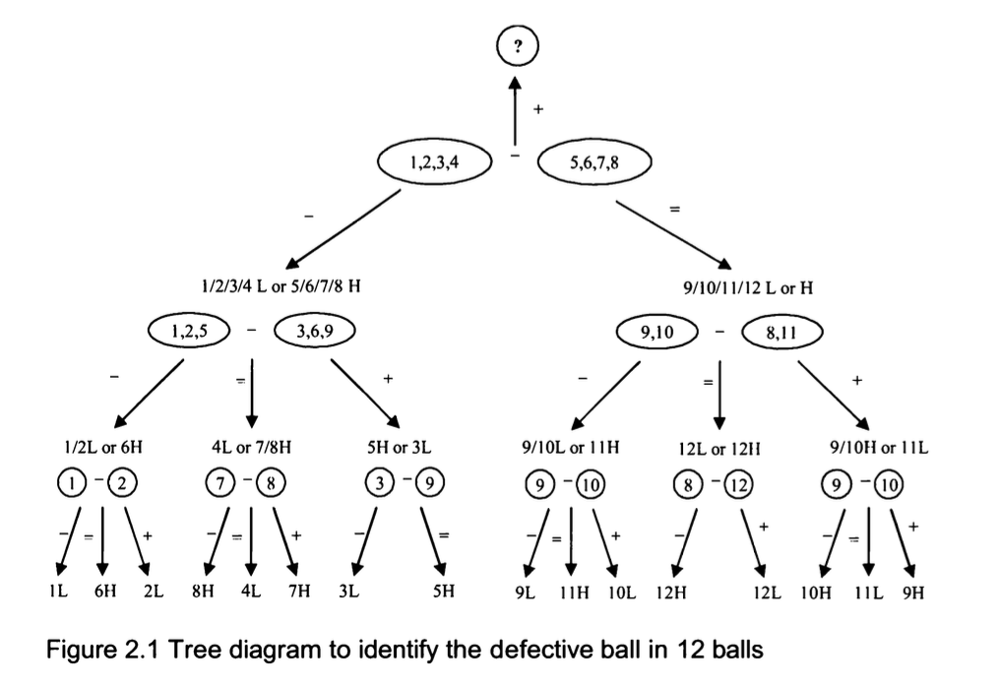

# Defective Ball

## Problem

You have **12 identical balls**. One of the balls is either **heavier or lighter** than the rest (you don't know which). Using a balance scale that can only show which side is heavier, how can you determine the defective ball with **just 3 measurements**?

Click to see the solution

### Solution

This weighing problem is a classic brain teaser and is still frequently asked in interviews. The key is to divide the balls into **three groups** instead of two during the weighing process. Here's the step-by-step explanation:

1. **Label the balls from 1 to 12.**
2. Divide them into **three groups of 4 balls each**:
   - Group 1: Balls 1, 2, 3, 4
   - Group 2: Balls 5, 6, 7, 8
   - Group 3: Balls 9, 10, 11, 12
3. **First measurement:** Compare Group 1 (balls 1, 2, 3, 4) against Group 2 (balls 5, 6, 7, 8).
   - If the two groups **balance**:
     - The defective ball is in Group 3 (balls 9, 10, 11, 12).
   - If Group 1 is **lighter** or **heavier** than Group 2:
     - The defective ball is in Group 1 or Group 2.

4. **Second measurement:** Narrow down the defective group further by comparing a subset of the suspected group against a known "normal" set of balls.
5. **Third measurement:** Using the information gathered, identify the exact defective ball and determine if it is heavier or lighter.

### Why divide into three groups?

The reason is that comparing two groups always provides information about the **third group**. This approach reduces the problem size by 2/3 with each measurement.

### Figure

The tree diagram below illustrates the step-by-step approach to identifying the defective ball. It shows how to narrow down possibilities through systematic comparisons:

### Additional Notes

- If the defective ball is known to be **either heavier or lighter**, the problem can be solved for up to **3^n balls in n measurements**.
- If there is no information about whether the defective ball is heavier or lighter, you can solve for up to **(3^n - 3) / 2 balls in n measurements**.

